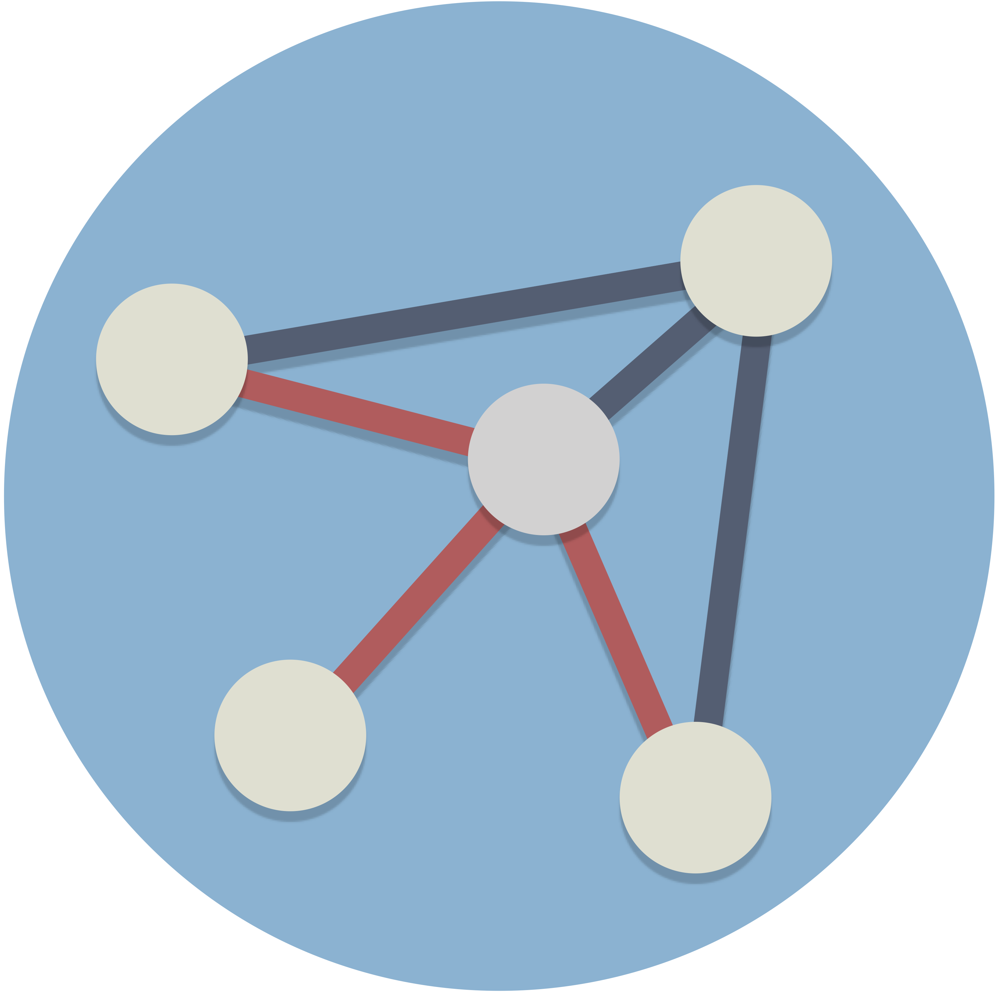

# Generating and Iterating Complex Networks
<!-- badges: start -->
[](https://cran.r-project.org/package=complexNet)
[](https://cran.r-project.org/package=complexNet)
[](https://github.com/marcosmolla/complexNet/actions/workflows/R-CMD-check.yaml)
[](https://lifecycle.r-lib.org/articles/stages.html#stable)
<!-- badges: end -->

# complexNet 
***
complexNet provides functions to easily generate and iterate complex networks. These networks rely on socially inherited and random connections to members of a population, as presented by [Ilany &amp; Akcay (2016)](https://www.nature.com/articles/ncomms12084). Their modelling framework has been shown to generate realistic networks with a wide range of different clustering, density, and average path length. In [Smolla &amp; Akcay (2019)](https://www.science.org/doi/10.1126/sciadv.aaw0609) we have used the same algorithms to generate networks and have them dynamically evolve. 

## Installation
```r
# Install release version from CRAN
install.packages("complexNet")

# Install development version from GitHub
devtools::install_github("marcosmolla/complexNet")
```

## What are complex networks?
The general idea of complex networks (in the sense of this package) is that each individual of a group has a set of parameters that determines its probability to share an edge with certain subsets of the population. The most common version differentiates three subsets: the parent, the direct network neighbours of the parent, and everyone else. The probability to form a connection with the parent is given by the probability $p_b$. Similarly, $p_n$ is the probability to have a connection with the neighbours of the parent, and $p_r$ is the probability to connect to anyone else. Because these probabilities regard different subsets of the population, they do not have to add up to 1. So far, the algorithm is only working for asexual populations (a single parent) but will be extended to also include a two parents version in the future. 


<figcaption>The schematic depicts how a new individual joins the population (as one other individual has been removed). In this case, it shares a link with its parent and will connect to the parent's neighbours with probability $p_n$, and to any other individual with probability $p_r$.</figcaption>

## Usage
To generate a complex network, use the `make_bnr()` function. You need to set the number of individuals in the network `n`, and their linking probabilities `pb`, `pn`, and `pr` (see an example below). To set up a new network set `np=c(0,0)`, which means that there is no ID set for who the newborn and the parent will be. Take a look at the vignette (in Articles at the top) to see how these networks can be iterated to simulate network dynamics and parameter evolution. 

```r
# Load library
library(complexNet)

# Create adjacency matrix for a complex network
ADJM <- make_bnr(n = 10, np = c(0,0), pb = 1, pn = .2, pr = .02)

# Load igraph library
library(igraph)

# Convert adjacency matrix to an igraph network
G <- graph_from_adjacency_matrix(ADJM)

# Plot network
plot(G)
```

## Example
Below is an example plot of networks generated with `make_bnr()` and for different social inheritance, $p_n$, and random linking, $p_r$, probabilities. As the linking probabilities increase, the networks become more connected. 


The following code generates a similar figure to the one shown here.

```r
# Load library
library(complexNet)
library(igraph)

par(mfrow=c(3,3), mar=rep(1.2,4))
apply(X = expand.grid(c(.1,.3,.5), c(0.01,0.03,0.05)), 1, function(p) {
 # Create adjacency matrix for a complex network
 ADJM <- make_bnr(n = 50, np = c(0,0), pb = 1, pn = p[1], pr = p[2])
 # Convert adjacency matrix to an igraph network
 G <- graph_from_adjacency_matrix(ADJM)
 # Calculate node degree centrality
 deg <- degree(G)
 # Select node colour based on its degree centrality
 V(G)$color <- heat.colors(rev = T, n = 25)[deg+1]
 # Plot network
 plot(G,
      main=paste("p_n: ",p[1],", p_r:",p[2], sep=""),
      vertex.label=NA,
      vertex.size=10,
      edge.arrow.size=0,
      vertex.color=V(G)$color)
})
```

## Out there
Here is a list of articles that use complex networks:

Ilany, A., & Akcay, E. (2016). Social inheritance can explain the structure of animal social networks. Nature Communications, 7(May), 1–23. https://doi.org/10.1101/026120

Ilany, A., & Akçay, E. (2016). Personality and Social Networks: A Generative Model Approach. Integrative and Comparative Biology, 56(6), 1197–1205. https://doi.org/10.1093/icb/icw068

Smolla, M., & Akçay, E. (2019). Cultural selection shapes network structure. Science Advances, 5(8), eaaw0609. https://doi.org/10.1126/sciadv.aaw0609


## How to cite this package?
```r
> citation("complexNet")

To cite package ‘complexNet’ in publications use:

  Smolla M (2022). complexNet: Complex Network Generation.
  R package version 0.2.0.
  https://CRAN.R-project.org/package=complexNet

A BibTeX entry for LaTeX users is

  @Manual{,
    title = {complexNet: Complex Network Generation},
    author = {Marco Smolla},
    year = {2022},
    note = {R package version 0.2.0},
    url = {https://CRAN.R-project.org/package=complexNet},
  }
```
